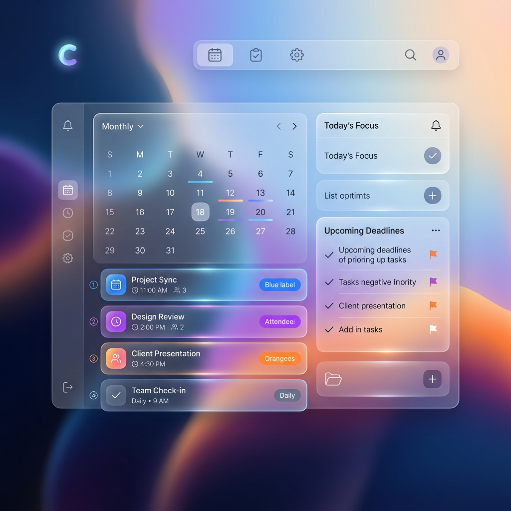

<div align="center">
  
  
  # 📅 Cadence
  
  **A Modern, Full-Stack Calendar & Task Management Application**
  
  [](https://vitejs.dev/)
  [](https://reactjs.org/)
  [](https://expressjs.com/)
  [](https://www.mysql.com/)
</div>

---

## 🌟 Introduction

**Cadence** is a premium calendar and organization tool designed to help you synchronize your life. With a focus on visual clarity and seamless performance, it combines event scheduling, task tracking, and note-taking into a single, cohesive experience.

Whether you're managing complex projects or simply staying on top of your daily routine, Cadence provides the tools you need in a beautiful, glassmorphism-inspired interface.

## ✨ Key Features

- 🔐 **Secure Authentication**: User registration and login powered by JWT (JSON Web Tokens) and bcrypt password hashing.
- 🗓️ **Interactive Calendar**: Full-featured monthly calendar view with event creation, editing, and deletion.
- ✅ **Task Management**: Structured task lists with status tracking (Pending/Done) and due dates.
- 📝 **Integrated Notes**: Create and manage notes tied to specific dates or events.
- 🔔 **Real-time Notifications**: Never miss an important deadline with built-in system notifications.
- 🎨 **Modern UI/UX**: Premium design aesthetic using Lucide React icons and a custom-crafted CSS design system.
- 📱 **Responsive Design**: Fully optimized for various screen sizes, ensuring a great experience on any device.

## 🛠️ Tech Stack

### Frontend
- **React (v19)**: Component-based UI library.
- **Vite**: Ultra-fast build tool and development server.
- **Lucide React**: Beautifully simple, consistent icons.
- **Date-fns**: Modern JavaScript date utility library.
- **Vanilla CSS**: Custom styling with modern variables and glassmorphism.

### Backend
- **Node.js & Express**: High-performance backend API.
- **MySQL**: Robust relational database for reliable data storage.
- **JWT & Bcrypt**: Secure authentication and password protection.

---

## 🚀 Getting Started

Follow these steps to get your own instance of Cadence up and running.

### Prerequisites

- [Node.js](https://nodejs.org/) (v18 or higher)
- [MySQL](https://www.mysql.com/) server
- [npm](https://www.npmjs.com/) or [yarn](https://yarnpkg.com/)

### Installation

1. **Clone the Repository**
   ```bash
   git clone git@github.com:kzmdsamir/Cadence.git
   cd calendar-app
   ```

2. **Frontend Setup**
   ```bash
   npm install
   ```

3. **Backend Setup**
   ```bash
   cd server
   npm install
   ```

### ⚙️ Configuration

Create a `.env` file in the `server` directory and configure the following variables:

```env
PORT=5000
DB_HOST=localhost
DB_USER=your_username
DB_PASSWORD=your_password
DB_NAME=cadence_db
JWT_SECRET=your_super_secret_key
```

### 🏃 Running the Application

1. **Start the Backend Server**
   ```bash
   cd server
   npm start
   ```

2. **Start the Frontend Development Server** (in a new terminal)
   ```bash
   cd ..
   npm run dev
   ```

3. **Visit the App**
   Open [http://localhost:5173](http://localhost:5173) in your browser.

---

## 📂 Project Structure

```text
├── public/                # Static assets
├── server/                # Backend Express API
│   ├── server.js          # Main server entry & DB logic
│   └── .env               # Server environment variables
├── src/                   # Frontend React Source
│   ├── App.jsx            # Main app component
│   ├── index.css          # Design system & global styles
│   └── main.jsx           # React entry point
├── package.json           # Frontend dependencies
└── README.md              # Project documentation
```

---

## 🤝 Contributing

Contributions are what make the open-source community such an amazing place to learn, inspire, and create. Any contributions you make are **greatly appreciated**.

1. Fork the Project
2. Create your Feature Branch (`git checkout -b feature/AmazingFeature`)
3. Commit your Changes (`git commit -m 'Add some AmazingFeature'`)
4. Push to the Branch (`git push origin feature/AmazingFeature`)
5. Open a Pull Request

---

## 📄 License

Distributed under the MIT License. See `LICENSE` for more information.

<div align="center">
  Developed with ❤️ by <a href="https://github.com/kzmdsamir">kzmdsamir</a>
</div>
